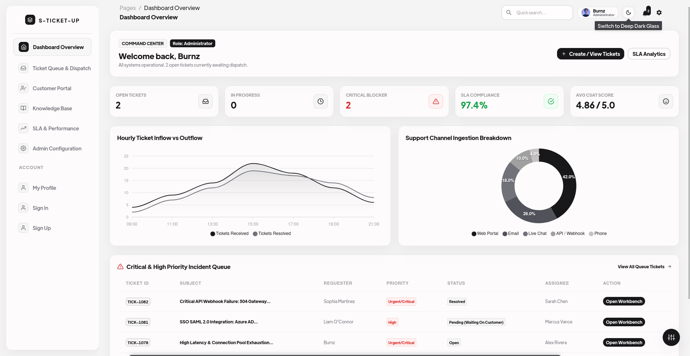

<div align="center">
  

  # 🎫 S-Ticket-UP (Smart-TS)
  ### Next-Gen Intelligent Helpdesk & Customer Support Platform

  [](https://reactjs.org/)
  [](https://chakra-ui.com/)
  [](https://apexcharts.com/)
  [](LICENSE)
  [](https://github.com/Gabzkk)

</div>

---

## 📌 Overview

**S-Ticket-UP (Smart-TS)** is a high-performance, glassmorphic ticketing and customer operations dashboard designed for modern enterprise support teams. Featuring real-time ticket dispatching, SLA tracking, deflection-first customer self-service portals, rich knowledge base directories, and a dual-mode monochrome glass aesthetic with ambient ripple effects.

---

## ✨ Key Features

- 📊 **Executive Command Center & Dashboard**:
  - Real-time hourly inflow vs. outflow volume area charts.
  - Channel ingestion breakdowns (Web Portal, Email, Live Chat, Webhook, Phone).
  - High-priority incident queue with live SLA breach indicators.

- 🎟️ **Ticket Queue & Interactive Workbench (`/admin/tickets`)**:
  - Bulk action toolbar with multi-select dispatch, status update, priority assignment, and deletion.
  - Granular ticket inspection with 4-step progress trackers, stopwatch time logging, internal private agent notes, customer replies, and audit timelines.

- 🌐 **Customer Self-Service Hub (`/admin/customer-portal`)**:
  - Dynamic ticket submission modal with category and subcategory routing.
  - Centered search and horizontal topic chips filter for immediate knowledge deflection.
  - Expandable self-service solution reader modal.

- 📚 **Knowledge Base Directory (`/admin/knowledge-base`)**:
  - Categorized documentation repository with search, tag filtering, and instant helpfulness ratings (`👍 Helpful` / `👎 Unhelpful`).
  - Modal article viewer and publishing interface.

- 📈 **SLA Analytics & Performance Reporting (`/admin/analytics`)**:
  - SLA policy compliance gauges, average resolution speed KPIs, and CSAT benchmarks.
  - Weekly resolution trends and department performance matrices.

- ⚙️ **Admin Configuration & Rules (`/admin/settings`)**:
  - Customizable SLA policies (Urgent/Critical, High, Medium, Low) with pause conditions and business-hour enforcement.
  - Automated ticket routing rules, webhook endpoint management, and macro templates.

- 👤 **Administrator Profile (`/admin/profile`)**:
  - Customized profile workbench for **Burnz (Administrator)**.
  - Notification subscription toggles, active security sessions tracking, and personal KPI summaries.

- 🎨 **Glassmorphism & Monochrome Dual Themes**:
  - **Light Glass**: `#fffdfd`, `#f4f4f4`, `#e1e1e3`, `#c5c2c2`, `#a1a0a0` with `blur(20px)` glass surfaces.
  - **Dark Glass**: `#09090b` canvas, `rgba(18, 18, 24, 0.78)` glass cards, `#f4f4f5` typography.
  - **Ripple Toggle**: Header-mounted theme toggle with slow ambient concentric ripple glow and interactive click waves.

---

## 🛠️ Technology Stack

- **Frontend Core**: React 17, React DOM
- **Component & Design System**: Chakra UI v1, Emotion 11
- **Icons**: React Icons (Feather Icons, FontAwesome, Bootstrap Icons)
- **Data Visualization**: ApexCharts & React-ApexCharts
- **Routing**: React Router v5 (`HashRouter`)
- **State Management**: React Context API (`TicketContext`) with `localStorage` persistence

---

## 🚀 Getting Started

### Prerequisites

- **Node.js** >= 16.x
- **npm** or **yarn**

### Installation

1. **Clone the repository**:
   ```bash
   git clone https://github.com/Gabzkk/Smart-TS.git
   cd Smart-TS
   ```

2. **Install dependencies**:
   ```bash
   npm install --legacy-peer-deps
   ```

3. **Start the development server**:
   ```bash
   npm start
   ```
   Open [http://localhost:3000/S-Ticket-UP](http://localhost:3000/S-Ticket-UP) in your browser (Brave, Chrome, Edge, Firefox).

4. **Build for production**:
   ```bash
   CI=false npm run build
   ```

---

## 📄 License & Copyright

Copyright © 2026 **Gabzkk**. All rights reserved.

Licensed under the [MIT License](LICENSE).
